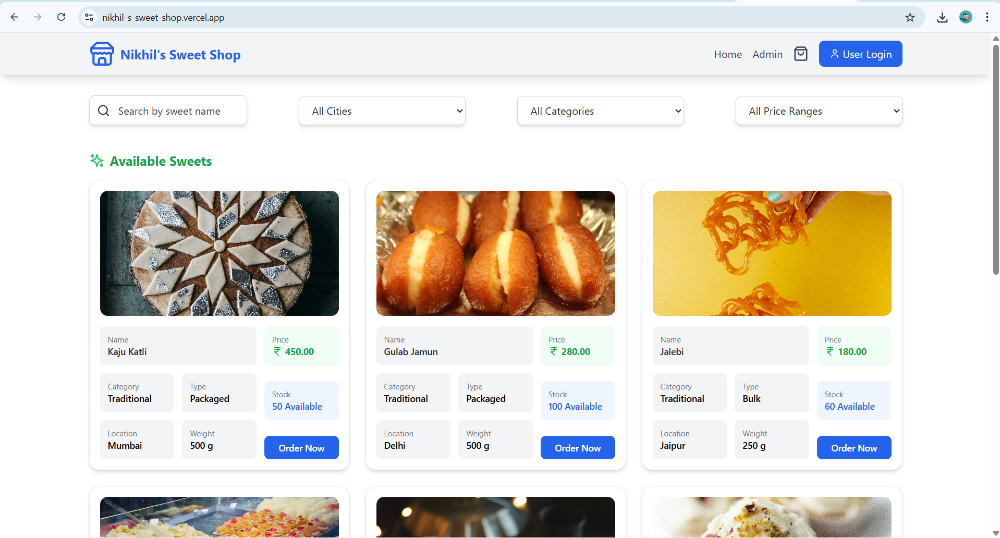
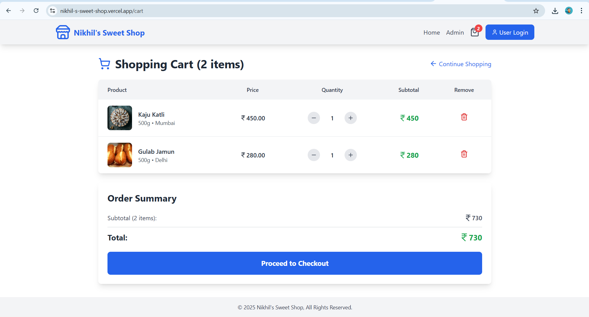
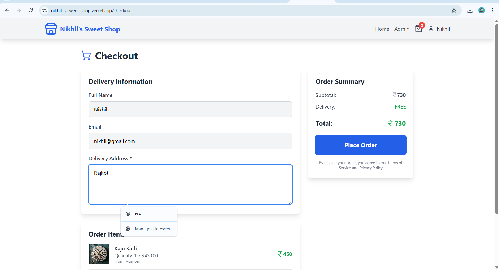
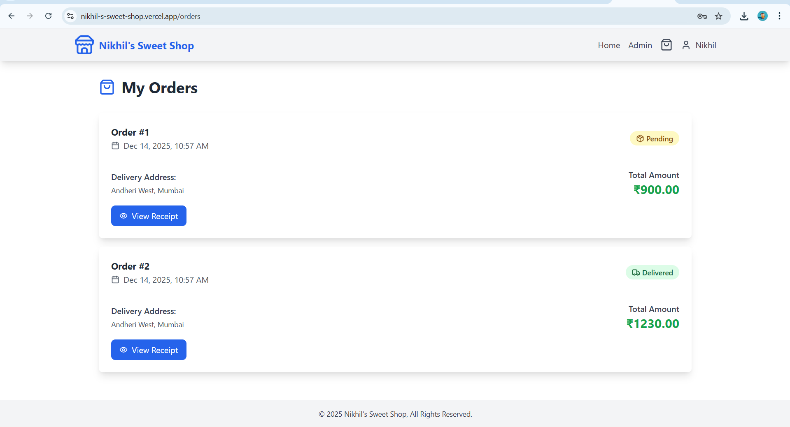
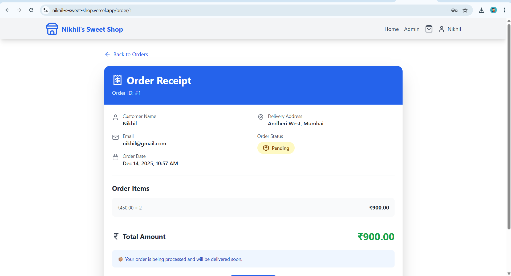
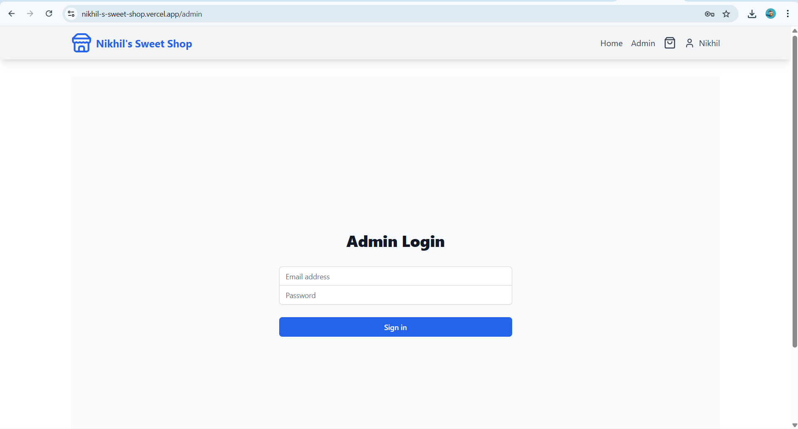
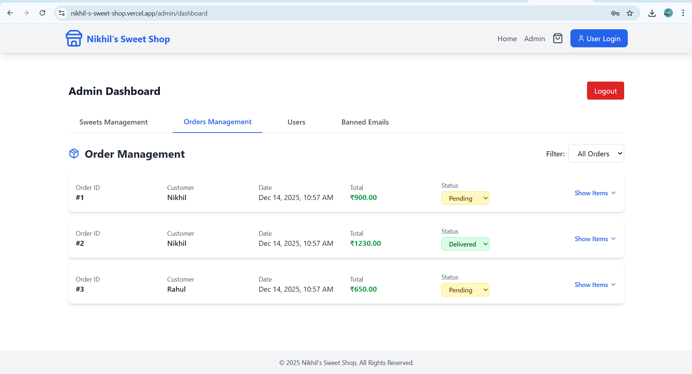
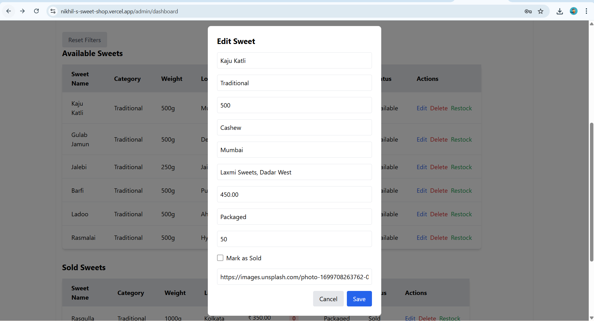
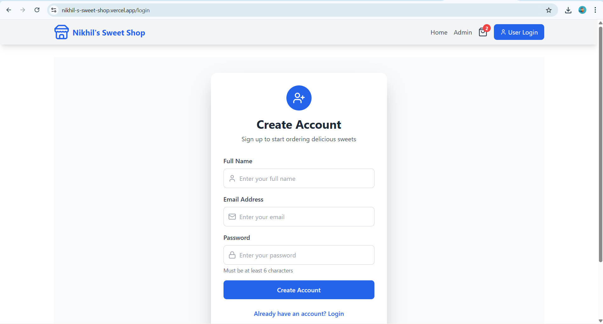

# ✦ Nikhil's Sweet Shop  
**Sweet Shop Management System – Incubyte Technical Assignment**

🌐 **Live Application:** https://nikhil-s-sweet-shop.vercel.app

---

## ✦ Project Overview

> **Incubyte Technical Assignment Submission**

I developed this project as part of the **Incubyte Sweet Shop Management System** technical assignment.

My goal was to build a **clean, full-stack application** that manages sweets, inventory, and purchases while following real-world business rules and clean coding practices.

---

✦ Application UI Overview

Below are real screenshots from the deployed application, demonstrating the complete user journey and system capabilities.

---

## 🏠 Home Page – Available Sweets

Features shown:

Sweet listing with cards

Search, city, category, and price filters

Stock availability

Order Now action

---

## 🛒 Shopping Cart

Features shown:

Cart item list

Quantity control (+ / −)

Subtotal & total calculation

Remove item option

---

## 💳 Checkout Page

Features shown:

Delivery information form

Order summary

Total amount calculation

Place Order action

---

## 📦 My Orders Page

Features shown:

Order history

Order status (Pending / Delivered)

Total amount

View receipt option

---

## 🧾 Order Receipt Details

Features shown:

Order ID

Customer details

Delivery address

Order status

Ordered items

Total amount

---

✦ What This UI Demonstrates (Incubyte Focus)

Complete end-to-end purchase flow

Backend-driven inventory & order management

Clear business rules enforcement

---

Real-world e-commerce workflow

Production-ready UI

---

## ✦ Admin Panel Overview

> The Admin Panel provides full control over sweets, inventory, orders, users, and system rules.  
> All admin actions are protected and backend-driven.

---

### 🔐 Admin Login

**Purpose:**
- Secure access for administrators
- Prevent unauthorized management actions

---

### 📊 Admin Dashboard – Sweets Management

**Features shown:**
- Total sweets count
- Available vs unavailable sweets
- Filters by category, status, and city
- Add new sweet
- Edit, delete, and restock sweets

---

### 📦 Orders Management

**Features shown:**
- View all orders
- Customer details
- Order date & total amount
- Update order status (Pending / Delivered)
- Expand order items

---

### ➕ Add New Sweet

**Features shown:**
- Sweet name, category, weight
- Flavor (optional)
- City & shop address
- Price and type (Packaged / Bulk)
- Initial stock quantity
- Image URL support

---

### ✏️ Edit Sweet Details

**Features shown:**
- Update sweet information
- Change price, stock, type, and location
- Mark sweet as sold
- Update image

---

### 🔄 Restock Sweet

**Features shown:**
- Update stock quantity
- Immediate inventory reflection
- Backend-validated stock update

---

## ✦ Admin Capabilities Summary

- Secure admin authentication
- Complete CRUD operations on sweets
- Inventory management (restock & sold status)
- Order tracking and status updates
- Real-time data reflected in user interface

This admin panel ensures **correct inventory handling and business rule enforcement**, as required in the Incubyte assignment.

---

## ✦ User Authentication

> The application provides a secure and user-friendly authentication system that allows customers to create accounts and log in before placing orders.

---

### 🔐 User Login

**Features shown:**
- Email & password-based login
- Clean and simple login UI
- Redirect to home and cart after login
- Protected user actions (orders, checkout)

---

### 📝 User Registration

**Features shown:**
- New user account creation
- Full name, email, and password input
- Password validation (minimum length)
- Seamless transition to login after registration

---

## ✦ Authentication Capabilities Summary

- Secure user login and registration
- Session-based user experience
- Only logged-in users can:
  - Place orders
  - View order history
  - Access checkout
- Authentication integrates with backend APIs and database

This authentication flow ensures a **real-world e-commerce experience** and supports secure order management, aligning with the Incubyte assignment requirements.

